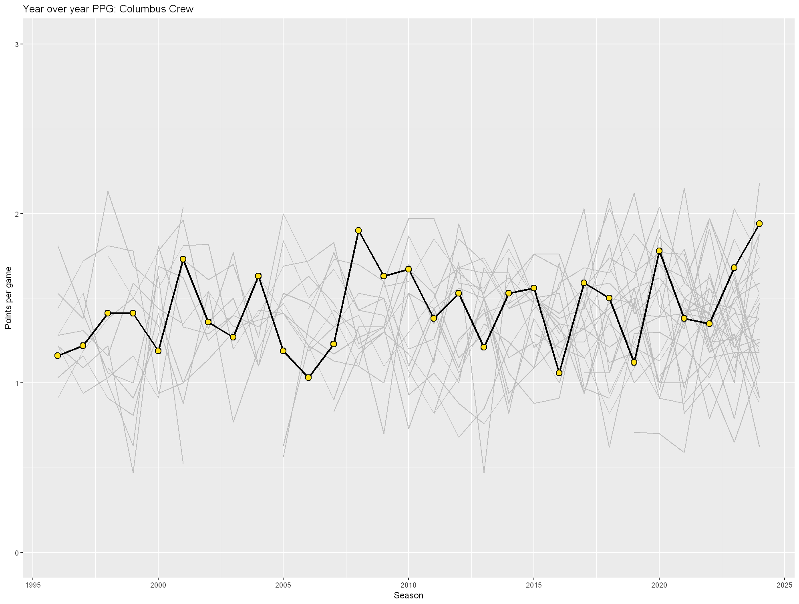
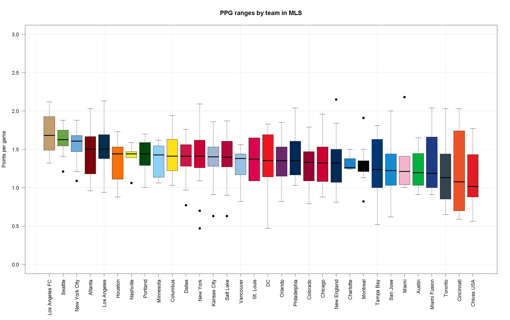

# Year over Year PPG in Major League Soccer

This is the result of a brief exploration of how teams in MLS have performed, as
measured by the points per game (PPG) metric, since the league started play in
1996. The investigation was inspired by [a post by bleakmidwinter on the MLS subreddit](https://www.reddit.com/r/MLS/comments/1hmtl0b/mls_standings_since_1996/).

The data comes from [the league website](https://www.mlssoccer.com/standings/2024/supporters-shield#season=1996), which means
that this uses whatever PPG calculation the league uses, particularly during the 
shootout years.

The analysis was done in R, and should be reproducible if you have packages like
ggplot2 installed. Most of the work is done in `plot.R`, while the color palette
used is defined in `colors.R`.

The results are found in the `plots` folder, as a series of images.

Suggestions and feedback are welcome! Hopefully someone finds this interesting.

